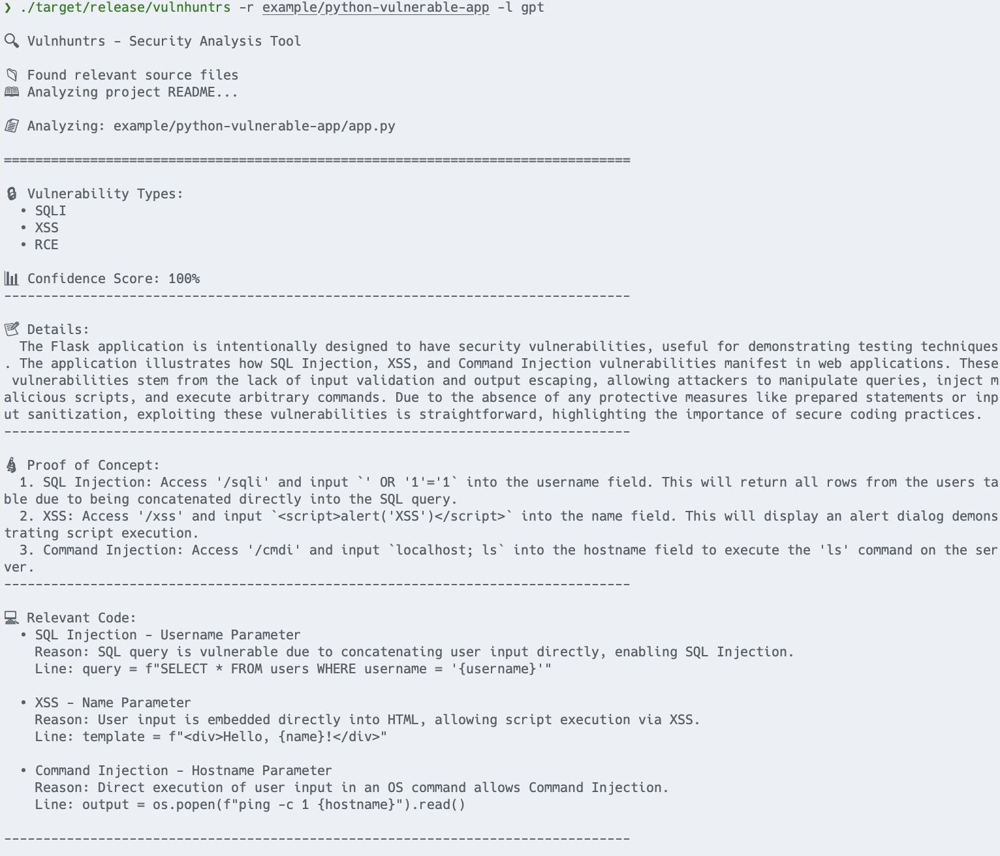

# Vulnhuntrs

Vulnhuntrs is a security analysis tool designed to detect vulnerabilities in applications. It provides static analysis capabilities to identify potential security issues in your codebase.

## Features

- Static code analysis for security vulnerabilities
- Support for multiple programming languages
- Detailed vulnerability reports
- Example vulnerable applications for testing



## Installation

```bash
# Clone the repository
git clone https://github.com/HikaruEgashira/vulnhuntrs.git

# Build the project
cargo build --release
```

## Usage

```bash
vulnhuntrs -r <path-to-project>
```

## Example Applications

The repository includes example vulnerable applications to demonstrate the tool's capabilities:

- `example/python-vulnerable-app`: A Python application with common vulnerabilities
```bash
export ANTHROPIC_API_KEY=your-api-key
cargo run -- -r example/python-vulnerable-app
```

- `example/rust-vulnerable-app`: A Rust application with common vulnerabilities
```bash
export OPENAI_API_KEY=your-api-key
cargo run -- -r example/rust-vulnerable-app -l gpt
```

These examples are for educational purposes only. Do not use them in production environments.

## Documentation

- See [DEVELOPMENT.md](DEVELOPMENT.md) for development guidelines and contributing information
- Check the `example/` directory for sample vulnerable applications

## Security

This tool is intended for security research and educational purposes only. Do not use the example vulnerable applications in production environments.

## License

MIT License
