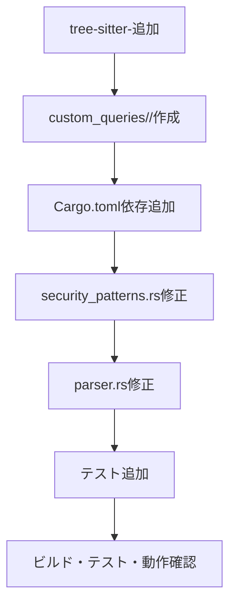

# 新しい言語追加手順（SASTプロジェクト用）

## 1. tree-sitter-<lang>の導入
- 対象言語のtree-sitterリポジトリを`tree-sitter-<lang>/`として追加（例: `git submodule add ...`）。
- 必要に応じて`npm install`や`cargo build`等でセットアップ。

## 2. custom_queries/<lang>/ ディレクトリ作成
- `custom_queries/<lang>/`を新規作成。
- `definitions.scm`と`references.scm`を用意し、tree-sitterノードに合わせて記述。

## 3. Rust側の対応
- `Cargo.toml`にtree-sitter-<lang>依存を追加。
- `src/security_patterns.rs`のLanguage enumとfrom_extensionに新言語を追加し、`security_patterns/patterns.yml`に対応パターンを記述。
- `src/parser.rs`のget_languageやget_query_path等で新言語対応を追加。

## 4. テスト追加
- `example/<lang>-vulnerable-app/`等に脆弱サンプルを用意（任意）。
- `tests/analyzer_test.rs`に新言語用テスト関数を追加。

## 5. 動作確認
- `cargo build`と`cargo test`でビルド・テスト。
- CLIやDockerで新言語の解析動作を確認。

---

## 全体フロー（Mermaid）

---

この手順は、既存のGo, Java, Python, Rust, JavaScript, TypeScriptの追加例・プロジェクト構成・命名規則・拡張ポイントを踏襲し、tree-sitterセットアップからテスト追加までを網羅したものです。
