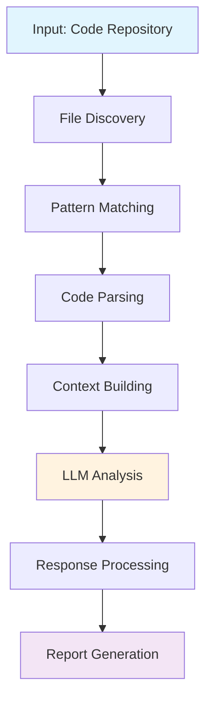

import { Callout } from 'fumadocs-ui/components/callout'
import { FileTree } from 'fumadocs-ui/components/files'

# Architecture

Vulnhuntrs follows a pipeline architecture that combines static code analysis with LLM-powered vulnerability detection. This document explains how the system works internally.

## High-Level Overview



The analysis process follows these key stages:

1. **File Discovery**: Identifies source files to analyze
2. **Pattern Matching**: Filters files using regex patterns  
3. **Code Parsing**: Uses tree-sitter for semantic analysis
4. **Context Building**: Collects function definitions and references
5. **LLM Analysis**: Sends code + context to AI models
6. **Response Processing**: Validates and formats findings
7. **Report Generation**: Creates structured output

## Core Components

### File System Structure

<FileTree>
  <FileTree.Folder name="src" defaultOpen>
    <FileTree.File name="main.rs" />
    <FileTree.File name="lib.rs" />
    <FileTree.File name="analyzer.rs" />
    <FileTree.File name="parser.rs" />
    <FileTree.File name="repo.rs" />
    <FileTree.File name="repo_clone.rs" />
    <FileTree.File name="response.rs" />
    <FileTree.File name="security_patterns.rs" />
    <FileTree.Folder name="prompts">
      <FileTree.File name="mod.rs" />
      <FileTree.File name="analysis.rs" />
      <FileTree.File name="evaluator.rs" />
    </FileTree.Folder>
  </FileTree.Folder>
  <FileTree.Folder name="security_patterns">
    <FileTree.File name="patterns.yml" />
  </FileTree.Folder>
  <FileTree.Folder name="custom_queries">
    <FileTree.Folder name="python">
      <FileTree.File name="definitions.scm" />
      <FileTree.File name="references.scm" />
    </FileTree.Folder>
    <FileTree.File name="..." />
  </FileTree.Folder>
</FileTree>

## Detailed Component Analysis

### 1. File Discovery (`repo.rs`)

The file discovery component is responsible for:

- **Repository cloning**: Downloads GitHub repositories locally
- **File enumeration**: Finds all source files in the target directory
- **Language detection**: Identifies programming languages
- **File filtering**: Applies include/exclude patterns

```rust
// Key functionality in repo.rs
pub struct Repository {
    pub path: PathBuf,
    pub files: Vec<SourceFile>,
}

impl Repository {
    pub fn discover_files(&mut self) -> Result<()> {
        // Walk directory tree
        // Filter by supported languages
        // Apply include/exclude patterns
    }
}
```

<Callout type="info">
  **Supported Languages**: Rust, Python, JavaScript, TypeScript, Go, Java, Ruby
</Callout>

### 2. Pattern Matching (`security_patterns.rs`)

Uses regex-based pattern matching to identify potentially vulnerable code:

```yaml
# security_patterns/patterns.yml
patterns:
  python:
    - name: "SQL Injection"
      pattern: "execute\\(.*%.*\\)|cursor\\.execute\\(.*\\.format\\("
      description: "Potential SQL injection via string formatting"
      
  javascript:
    - name: "Command Injection"  
      pattern: "exec\\(|spawn\\(|execSync\\("
      description: "Potential command injection"
```

**Pattern Categories**:
- SQL injection patterns
- Command injection patterns  
- XSS vulnerability patterns
- File inclusion patterns
- Deserialization patterns

### 3. Code Parsing (`parser.rs`)

Uses tree-sitter parsers for semantic code analysis:

```rust
// parser.rs core functionality
pub struct CodeParser {
    language: SupportedLanguage,
    parser: tree_sitter::Parser,
}

impl CodeParser {
    pub fn parse_file(&self, content: &str) -> ParseResult {
        // Parse code into AST
        // Extract function definitions
        // Find function references
        // Build context relationships
    }
}
```

**Tree-sitter Integration**:
- **AST Parsing**: Converts source code to Abstract Syntax Trees
- **Query System**: Uses tree-sitter queries to extract semantic information
- **Multi-language**: Supports 7+ programming languages
- **Context Extraction**: Identifies function calls, definitions, imports

### 4. Context Building

Builds comprehensive context for LLM analysis:

#### Function Definitions
```rust
pub struct FunctionDefinition {
    pub name: String,
    pub parameters: Vec<String>,
    pub body: String,
    pub line_start: usize,
    pub line_end: usize,
}
```

#### Function References  
```rust
pub struct FunctionReference {
    pub name: String,
    pub caller: String,
    pub line: usize,
    pub context: String,
}
```

#### Context Assembly
The system collects:
- Function definitions and their implementations
- Function call sites and usage patterns
- Import statements and dependencies
- Variable assignments and data flow

### 5. LLM Analysis (`analyzer.rs`)

The core vulnerability detection engine:

```rust
pub struct VulnerabilityAnalyzer {
    client: genai::Client,
    model: String,
}

impl VulnerabilityAnalyzer {
    pub async fn analyze_file(&self, file: &SourceFile, context: &CodeContext) -> Result<AnalysisResult> {
        // Build analysis prompt
        // Send to LLM with context
        // Parse structured response
        // Validate findings
    }
}
```

**LLM Integration**:
- **Multi-provider**: Supports OpenAI, Anthropic, Google
- **Structured Prompts**: Uses specialized prompts for security analysis
- **Context Injection**: Includes relevant code context with each analysis
- **Response Validation**: Ensures consistent, structured output

### 6. Prompt Engineering (`prompts/`)

Specialized prompts optimized for security analysis:

#### Analysis Prompt (`prompts/analysis.rs`)
- **System Context**: Establishes role as security expert
- **Code Context**: Provides file content and surrounding context
- **Vulnerability Focus**: Guides analysis toward remotely exploitable issues
- **Output Format**: Enforces structured JSON response

#### Evaluator Prompt (`prompts/evaluator.rs`)  
- **Confidence Scoring**: Assigns 0-10 confidence levels
- **Vulnerability Classification**: Categorizes by type (RCE, SQLI, etc.)
- **Impact Assessment**: Evaluates potential damage
- **PoC Generation**: Creates proof-of-concept exploits

### 7. Response Processing (`response.rs`)

Handles LLM response validation and formatting:

```rust
#[derive(Deserialize)]
pub struct AnalysisResponse {
    pub vulnerabilities: Vec<Vulnerability>,
    pub analysis_notes: String,
    pub confidence: u8,
}

#[derive(Deserialize)]  
pub struct Vulnerability {
    pub vulnerability_type: VulnerabilityType,
    pub description: String,
    pub poc: Option<String>,
    pub confidence: u8,
}
```

**Response Validation**:
- **JSON Schema**: Enforces consistent response structure
- **Confidence Bounds**: Validates 0-10 confidence scores
- **Type Checking**: Ensures vulnerability types are recognized
- **Sanitization**: Removes potentially harmful content

## Language Support Architecture

### Tree-sitter Integration

Each supported language has:

1. **Parser Configuration** (`build.rs`):
```rust
fn main() {
    // Configure tree-sitter parsers for each language
    cc::Build::new()
        .include("tree-sitter-python/src")
        .file("tree-sitter-python/src/parser.c")
        .compile("tree-sitter-python");
}
```

2. **Custom Queries** (`custom_queries/<language>/`):
```scheme
; definitions.scm - Extract function definitions
(function_definition
  name: (identifier) @function.name
  body: (block) @function.body)

; references.scm - Find function calls  
(call
  function: (identifier) @function.call)
```

3. **Pattern Definitions** (`security_patterns/patterns.yml`):
```yaml
python:
  - name: "Unsafe eval"
    pattern: "eval\\(|exec\\("
    confidence: 8
```

### Adding New Languages

<Callout type="info">
  See [docs/ADD_NEW_LANGUAGE.md](/docs/add-new-language) for detailed instructions on adding support for additional programming languages.
</Callout>

The process involves:
1. Adding tree-sitter parser dependency
2. Creating custom queries for definitions/references
3. Adding security patterns
4. Updating language enum and parser logic

## Performance Considerations

### Optimization Strategies

1. **Pattern Pre-filtering**: Only parse files that match security patterns
2. **Incremental Analysis**: Cache parse results for unchanged files  
3. **Parallel Processing**: Analyze multiple files concurrently
4. **Context Limiting**: Bound context size to prevent token overflow

### Memory Management

```rust
// Streaming approach for large files
pub fn analyze_large_file(file: &Path) -> Result<()> {
    let mut reader = BufReader::new(File::open(file)?);
    let mut buffer = String::new();
    
    // Process file in chunks
    while reader.read_line(&mut buffer)? > 0 {
        // Analyze chunk with limited context
        buffer.clear();
    }
}
```

### Scalability Features

- **Configurable concurrency**: Adjust parallel analysis threads
- **Memory bounds**: Limit context size and cache usage
- **Progressive analysis**: Start with high-confidence patterns
- **Incremental reporting**: Stream results as analysis progresses

## Security Model

### Input Validation

- **Path traversal protection**: Validate all file paths
- **Content sanitization**: Limit file sizes and content types
- **Pattern injection prevention**: Validate regex patterns

### API Key Security

- **Environment variables**: Never log or expose API keys
- **Memory cleanup**: Clear sensitive data after use
- **Minimal permissions**: Use least-privilege API access

### Output Security  

- **Content filtering**: Remove potentially malicious PoC code
- **Path sanitization**: Prevent directory traversal in reports
- **Size limits**: Bound output file sizes

## Error Handling

### Graceful Degradation

```rust
pub enum AnalysisError {
    ParseError(String),
    LLMError(String), 
    NetworkError(String),
    RateLimitError,
}

impl VulnerabilityAnalyzer {
    pub async fn analyze_with_fallback(&self, file: &SourceFile) -> AnalysisResult {
        match self.analyze_file(file).await {
            Ok(result) => result,
            Err(AnalysisError::RateLimitError) => {
                // Retry with backoff
                self.retry_with_backoff(file).await
            }
            Err(e) => {
                // Log error and continue with next file
                log::warn!("Analysis failed for {}: {}", file.path, e);
                AnalysisResult::skipped(file.path.clone())
            }
        }
    }
}
```

### Recovery Strategies

- **Rate limit handling**: Exponential backoff and retry
- **Network failures**: Offline mode with pattern-only analysis  
- **Parse errors**: Skip problematic files and continue
- **Memory exhaustion**: Reduce context size and retry

## Testing Architecture

### Unit Tests
- **Component isolation**: Test each module independently
- **Mock LLM responses**: Use deterministic test data
- **Edge case coverage**: Handle malformed inputs gracefully

### Integration Tests  
- **End-to-end workflows**: Test complete analysis pipeline
- **Example applications**: Use known vulnerable code samples
- **Performance benchmarks**: Measure analysis speed and accuracy

### Snapshot Testing
```rust
#[test]
fn test_analysis_output() {
    let result = analyze_file("example/vulnerable.py");
    insta::assert_yaml_snapshot!(result);
}
```

Using `insta` crate for consistent output validation across versions.

## Next Steps

- [Learn about configuration options](/docs/configuration)
- [Explore usage examples](/docs/examples)  
- [Contribute to development](/docs/contributing)